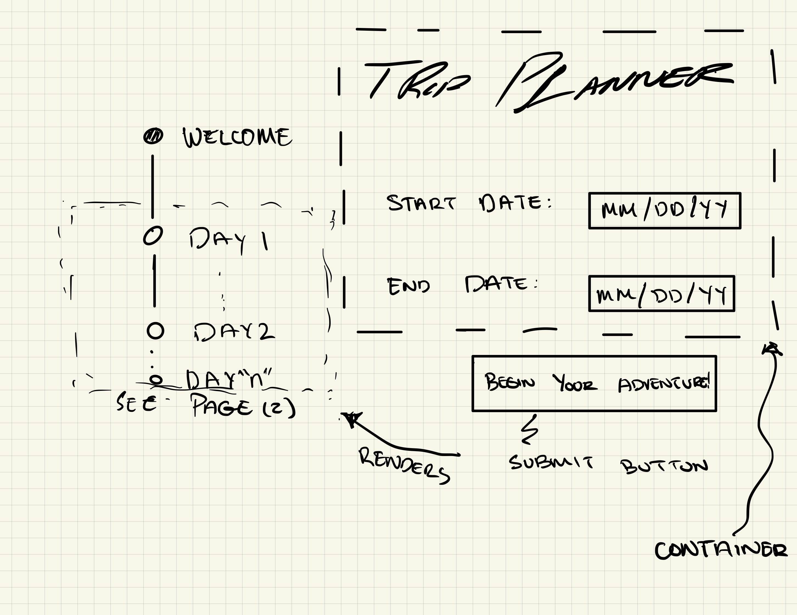
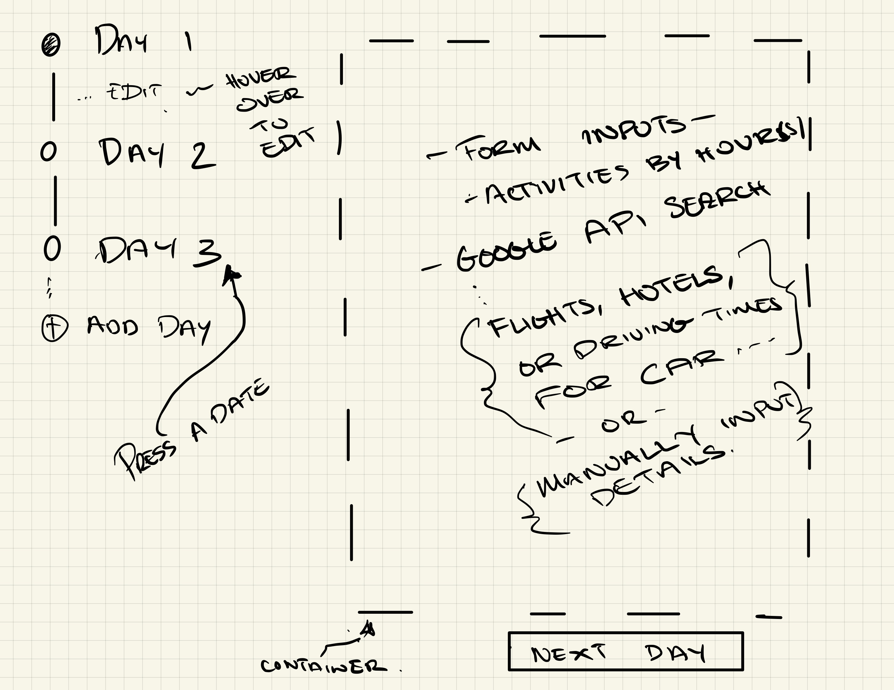

# TripPlanner

___

## Preface 

---

This project was built to fulfill the project requirements of **Phase 1** of the **Flatiron - Software Engineer - Flex** 
program. 

## Requirements

---

The following are the rubric requirements for this project:

### Languages

- [ ] HTML
- [ ] Vanilla Javascript
- [ ] CSS

### Functionality 

- [ ] Build a Single Page Application (SPA).
- [ ] Utilize an open Application Program Interface (API).
- [ ] Utilize at least three (3) unique event-listeners.
- [ ] Must implement at least one (1) instance of array iteration, such as `foreach`, `map`, `filter`, etc.
- [ ] Build a Minimum Viable Product (MVP).
- [ ] Utilize a `json-server` in the project (Optional).

## Introduction

---

Trip Planner is a single page application to help you organize and plan your next trip or getaway.
This application will utilize `Google API` in order to search for hotels, flights, or drive time.

## User Interface Design

---

This Minimum Viable Product (MVP) will go through numerous iterations with the user interface design as the bare-bone of 
the code is built up with features. Some features will be implemented or removed from the wireframe concepts if they are
deemed viable or not viable for the purpose of this application. 

Below are the iterations of wireframe concepts for this application:

### Iteration #1

---

#### Landing Page

#### Form Page

### Resources

---

1) Background
   - https://gallery.yopriceville.com/Backgrounds/Summer_Sunrise_Background#.Yo3KMy-B1nQ